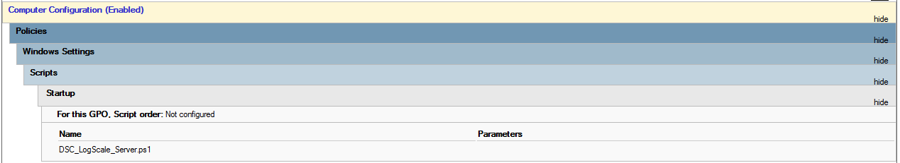

# LogScale DSC Creator
Create a powershell DSC configuration file for use in a group policy to distribute and enroll the Falcon LogScale Collector.

Dieses Skript erstellt eine Powershell DSC Datei die innerhalb einer Gruppenrichtlinie verwendet werden kann. So ist es möglich, bequem über die Gruppenrichtlinie die Installation des Falcon LogScale Collectors durchzuführen. Und diesen über das FleetManagement zu verbinden. Hierbei kann für jede Gruppenrichtlinie ein eigenes Skript verwendet werden. Dadurch können unterschiedliche EnrollmentTokens genutzt werden, die in verschiedene Repositories von LogScale zeigen.

## Configuration
Nach dem man das Repository oder die beiden notwendigen Dateien, ``Invoke-CreateLogScaleDSC.ps1`` und ``config.json``. Muss die ``config.json`` an das eigene Repository angepasst werden. In dieser sind die folgenden Parameter einzustellen:

|Parameter|Beschreibung|
|-----|----|
|dsc_share|UNC Pfad für die Ablage der Powershell DSC Dateien|
|installation_file|Kompletter Pfad zur MSI-Datei vom Falcon LogScale Collector|
|sections|Abschnitte die je eine Powershell DSC Datei erzeugen|


### Parameter "dsc_share"

Der folgende Parameter **dsc_share** muss auf den Pfad zeigen, wo später der Ordner mit den DSC Dateien liegt. Z.B. 
```
\\\\domain.com\\netlogon\\logscale
```
Bitte darauf achten, das es doppelte Schrägstriche sind. Diese müssen escaped werden, wenn sie in einer JSON-Datei verwendet werden.

### Parameter "installation_file"

Der Parameter **installation_file** ist der UNC-Pfad mit der eigentlichen Installationsdatei vom Falcon LogScale Collector. Z. B.
```
\\\\domain.com\\netlogon\\logscale\\installation\\humio-log-collector_1.5.1_windows_amd64.msi
```
Bitte darauf achten, das es doppelte Schrägstriche sind. Diese müssen escaped werden, wenn sie in einer JSON-Datei verwendet werden.

### Sections

```
    "sections": [
        {
            "name": "Server",
            "enrollmentToken": "####"
        },      
        {
            "name": "Exchange",
            "enrollmentToken": "####"
        },      
        {
            "name": "SQL",
            "enrollmentToken": "####"
        }      
    ]
```

Es können beliebig viele Sektionen angelegt werden. Diese erzeugen je eine Powershell DSC und ein Powershell Start Skript. Kopiert dazu einfach einen bestehenden Eintrag. Jede Sektion benötigt mindestens den folgenden Inhalt:

|Parameter|Beschreibung|
|-----|----|
|name|Name der Sektion|
|enrollmentToken|Enrollment token aus dem LogScale Fleetmanagement|


### Enrollment Token

Der Enrollment Token kann über die Fleetmanagement Konsole kopiert werden. Einen Artikel der beschreibt wie der erzeugt werden kann, ist hier zu finden [mylogscale.com / Enrollment Token – Was ist das](https://mylogscale.com/enrollment-token-was-ist-das/).

## Ausführen des Scripts

Wenn ihr hier angekommen seit, dann könnt ihr das Powershell Script starten. Ihr wechselt in den Ordner und startet eine Powershell Instanz

```Batch
.\Invoke-CreateLogScaleDSC.ps1
```

Damit werden in dem Verzeichnis in dem das Script gespeichert wurde, die Dateien erzeugt. Das Script erzeugt anschließend die benötigten Dateien in den Ordnern **GroupPolicy** und **InstallLogScaleCollector**.

## Erstellen der Gruppenrichtlinie

Das Powershell DSC Script wird beim Start des Computers aufgerufen. Um dieses zu erledigen muss der folgende Parameter konfiguriert werden.

**Computer Configuration / Policies / Windows Settings / Scripts / Startup**

In diesem Bereich kann im Tab **PowerShell Scripts** die Datei angegeben werden, die in dem Ordner GroupPolicy zu finden ist und der Section der Gruppenrichtlinie entspricht. Diese muss auch in den entsprechenden Ordner kopiert werden. Dieser kann über die Schaltfläche **Show Files** geöffnet werden.


Anschließend kann die Gruppenrichtlinie zugewiesen werden und getestet werden. 